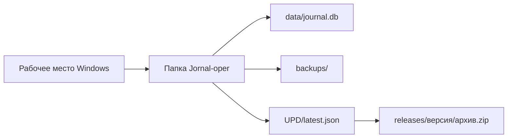

<p align="center">
  
</p>

<p align="center">
  
  
  
  
  
</p>

<p align="center">
  Локальное Windows-приложение для ведения журнала операций и анестезии:<br>
  быстрый ввод, поиск, статистика, справочники и резервные копии без обязательного облачного сервиса.
</p>

<p align="center">
  <a href="#возможности">Возможности</a> ·
  <a href="#быстрый-старт">Быстрый старт</a> ·
  <a href="#хранение-данных">Хранение данных</a> ·
  <a href="#сборка-релиза">Сборка</a> ·
  <a href="#тесты">Тесты</a>
</p>

---

## О программе

«Журнал пациентов» помогает небольшому хирургическому или анестезиологическому подразделению вести рабочий учёт в одном окне. Программа объединяет плотную таблицу случаев, форму быстрого добавления, фильтры, справочники и статистический отчёт.

Приложение рассчитано на локальное или внутрисетевое развёртывание под Windows. Место хранения общей базы выбирается в настройках, а локальный компьютер хранит только указатель на выбранную папку.

## Возможности

| Работа с журналом | Эксплуатация |
|---|---|
| Добавление, редактирование и удаление случаев | Выбор папки общего журнала |
| Повторные операции пациента как отдельные случаи | Недельные резервные копии SQLite |
| Поиск по ФИО и дате операции | Проверка целостности пакета обновления по SHA-256 |
| Плановые и экстренные операции | Автообновление локальной сборки из папки `UPD` |
| Автоматический расчёт длительности анестезии | Диагностика времени запуска по запросу |
| Справочники видов анестезии, врачей и медсестёр | Безопасная миграция схемы базы данных |
| Отчёт по периоду, типам операций и участникам | Откат установленной версии при ошибке обновления |

<p align="center">
  
</p>

> Изображения в README — рекламные иллюстрации продукта. Они передают назначение и визуальный язык программы, но не заменяют точный снимок конкретной установленной версии.

## Повседневный сценарий

1. Сотрудник выбирает папку общего журнала при первом запуске.
2. Вносит сведения об операции через форму справа от таблицы.
3. Находит нужный случай по ФИО или дате.
4. При необходимости редактирует либо удаляет только выбранный случай.
5. Формирует статистику за период в разделе «Отчёты».

Повторный номер истории не перезаписывает прежнюю операцию: каждый случай получает собственный внутренний `id`.

<p align="center">
  
</p>

## Хранение данных



| Расположение | Назначение |
|---|---|
| `Jornal-oper/data/journal.db` | Общая SQLite-база журнала |
| `Jornal-oper/settings.json` | Общие настройки и справочники |
| `Jornal-oper/backups/` | Недельные резервные копии |
| `Jornal-oper/UPD/` | Манифест и архивы обновлений |
| `%LOCALAPPDATA%/JornalPatients/connection.json` | Локальный указатель на общую папку |

Резервная копия создаётся при первом успешном запуске в каждой ISO-неделе. Папка базы и права доступа к ней должны настраиваться ответственным ИТ-специалистом организации.

<p align="center">
  
</p>

## Быстрый старт

### Требования

- Windows 10 или 11;
- Python 3.10 или новее для запуска из исходного кода;
- PySide6.

### Запуск из исходного кода

```powershell
git clone https://github.com/Donkiton/jornal.git
cd jornal

python -m venv .venv
.\.venv\Scripts\Activate.ps1
python -m pip install --upgrade pip
python -m pip install -r requirements.txt
python modern_app.py
```

При первом запуске программа предложит выбрать папку журнала. Для безопасной проверки можно указать пустую тестовую папку — необходимые подпапки и новая база будут созданы автоматически.

## Статистический отчёт

Раздел «Отчёты» формирует статистику за всё время или выбранный период:

- общее количество операций;
- плановые и экстренные случаи;
- распределение по видам анестезии;
- количество и доля случаев по врачам и медсёстрам.

## Сборка релиза

Для сборки Windows-приложения установите зафиксированные зависимости сборки и запустите единый сценарий релиза:

```powershell
python -m pip install -r requirements-build.txt
python build_release.py
```

Результат:

```text
dist/
├── JournalPatients/          # переносимая onedir-сборка
└── JournalPatients-1.0.2.zip # архив релиза
```

Для публикации в общую папку обновлений:

```powershell
python build_release.py --publish-root "\\server\share\Jornal-oper"
```

Сценарий создаёт версионный архив, вычисляет SHA-256 и атомарно обновляет `UPD/latest.json`. Установленная сборка проверяет более новую версию при закрытии приложения.

> Единый источник версии — [`app_version.py`](./app_version.py). Версия исходного кода может быть новее последнего опубликованного GitHub Release.

## Тесты

```powershell
python -m unittest discover -s tests -v
```

Тесты проверяют миграцию старой схемы, повторные номера истории, адресное редактирование и удаление выбранного случая.

## Ограничения

- приложение не заменяет полноценную медицинскую информационную систему;
- встроенной ролевой модели и централизованной авторизации пока нет;
- безопасность общей папки определяется правами Windows и правилами организации;
- перед использованием с реальными медицинскими данными требуется согласование с ответственными за ИТ и обработку персональных данных;
- переносить нужно всю папку `dist/JournalPatients`, а не один исполняемый файл.

## Структура проекта

| Путь | Назначение |
|---|---|
| [`modern_app.py`](./modern_app.py) | Основное PySide6-приложение |
| [`database_schema.py`](./database_schema.py) | Схема SQLite и миграции |
| [`update_system.py`](./update_system.py) | Проверка и установка обновлений |
| [`build_release.py`](./build_release.py) | Сборка и публикация релиза |
| [`JournalPatients.spec`](./JournalPatients.spec) | Конфигурация PyInstaller |
| [`requirements.txt`](./requirements.txt) | Зависимости для запуска из исходного кода |
| [`requirements-build.txt`](./requirements-build.txt) | Дополнительные зависимости для сборки релиза |
| [`tests/`](./tests) | Регрессионные тесты |
| [`ATTRIBUTION.md`](./ATTRIBUTION.md) | Атрибуция иконок интерфейса |

---

<p align="center">
  
</p>

<p align="center">
  Начните с тестовой базы и одного рабочего места, проверьте свои сценарии,<br>
  а затем принимайте решение о развёртывании в подразделении.
</p>
